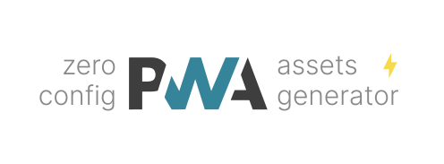

<p align='center'>
<br>
Zero-config PWA Assets Generator
</p>

<p align='center'>
<a href='https://www.npmjs.com/package/@vite-pwa/assets-generator' target="__blank">

</a>
<a href="https://www.npmjs.com/package/@vite-pwa/assets-generator" target="__blank">
    
</a>
<a href="https://vite-pwa-org.netlify.app/assets-generator" target="__blank">
    
</a>
<br>
<a href="https://github.com/vite-pwa/assets-generator" target="__blank">

</a>
</p>

<br>

<p align="center">
  <a href="https://cdn.jsdelivr.net/gh/antfu/static/sponsors.svg">
    
  </a>
</p>


## 🚀 Features

- 📖 [**Documentation & guides**](https://vite-pwa-org.netlify.app/)
- 👌 **Zero-Config**: sensible built-in default configs for common use cases
- 🔩 **Extensible**: expose the full ability to customize the behavior of the plugin
- 🦾 **Type Strong**: written in [TypeScript](https://www.typescriptlang.org/)
- 🔌 **Offline Support**: generate service worker with offline support (via Workbox)
- ⚡ **Fully tree shakable**: auto inject Web App Manifest
- 💬 **Prompt for new content**: built-in support for Vanilla JavaScript, Vue 3, React, Svelte, SolidJS and Preact
- ⚙️ **Stale-while-revalidate**: automatic reload when new content is available
- ✨ **Static assets handling**: configure static assets for offline support
- 🐞 **Development Support**: debug your custom service worker logic as you develop your application
- 🛠️ **Versatile**: integration with meta frameworks: [îles](https://github.com/ElMassimo/iles), [SvelteKit](https://github.com/sveltejs/kit), [VitePress](https://github.com/vuejs/vitepress), [Astro](https://github.com/withastro/astro), [Nuxt 3](https://github.com/nuxt/nuxt) and [Remix](https://github.com/remix-run/remix)
- 💥 **PWA Assets Generator**: generate all the PWA assets from a single command and a single source image
- 🚀 **PWA Assets Integration**: serving, generating and injecting PWA Assets on the fly in your application

## 📦 Install

```bash
# npm 
npm i @vite-pwa/assets-generator -D 

# yarn 
yarn add @vite-pwa/assets-generator -D

# pnpm 
pnpm add @vite-pwa/assets-generator -D
```

## 🦄 Usage

Create `pwa-assets.config.js` or `pwa-assets.config.ts` file in your root project folder and configure a preset and the images to use to generate the PWA assets:

```ts
import { defineConfig, minimalPreset as preset } from '@vite-pwa/assets-generator/config'

export default defineConfig({
  preset,
  images: [
    'public/logo.svg',
    'public-dev/logo.svg'
  ]
})
```

then, add the following script to your `package.json` and run it:

```json
{
  "scripts": {
    "generate-pwa-assets": "pwa-assets-generator"
  }
}
```

Read the [📖 documentation](https://vite-pwa-org.netlify.app/assets-generator) for a complete guide on how to configure and use
`@vite-pwa/assets-generator` CLI.

To use this library programmatically, check out the [API documentation](https://vite-pwa-org.netlify.app/assets-generator/api).

## 👀 Full config

Check out the type declaration [src/config.ts](./src/config.ts) for more details.

## 📄 License

[MIT](./LICENSE) License &copy; 2023-PRESENT [Anthony Fu](https://github.com/antfu)
